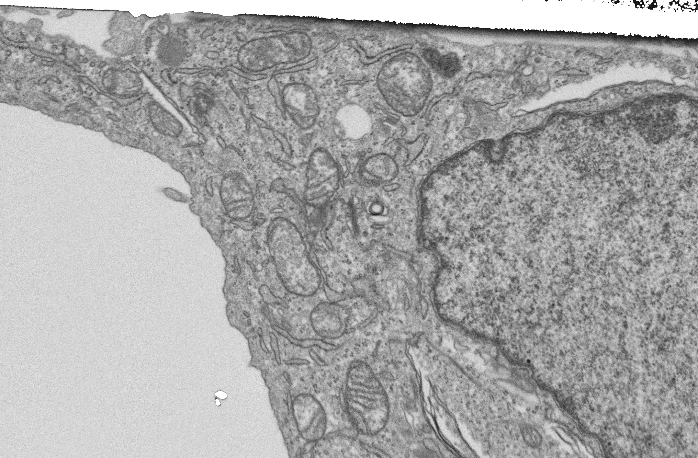
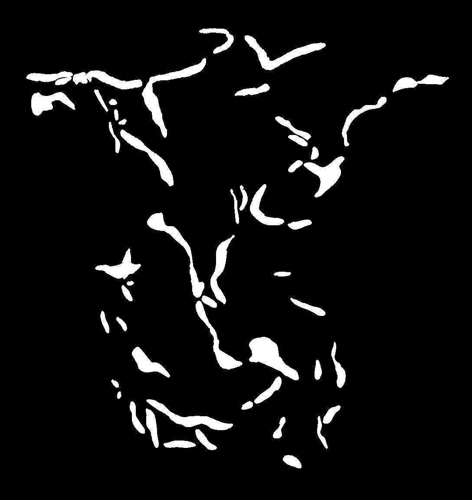
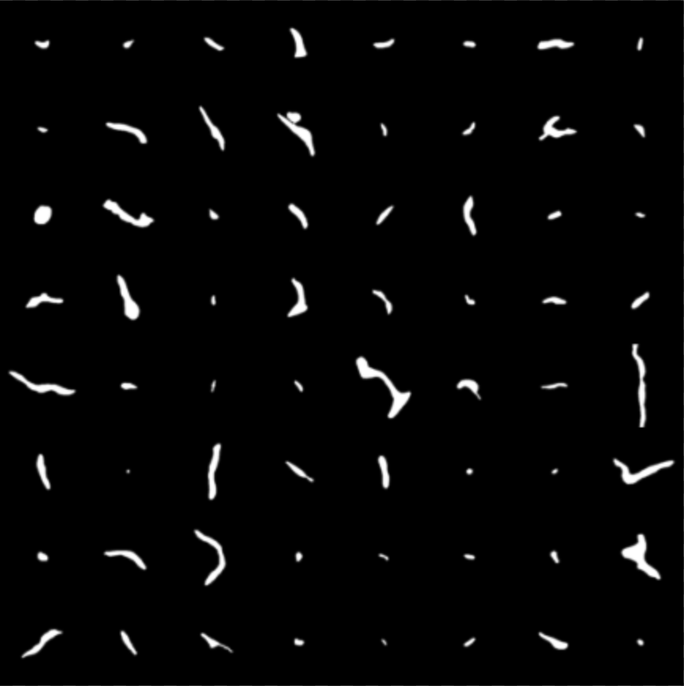
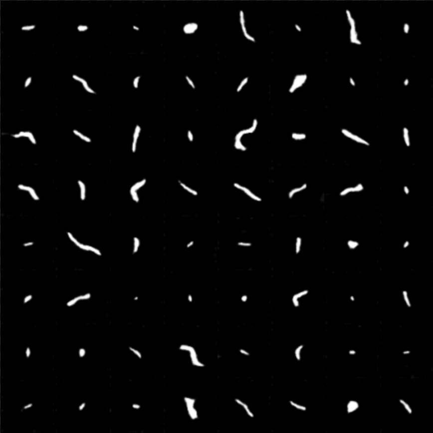
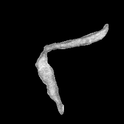
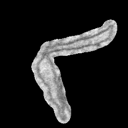
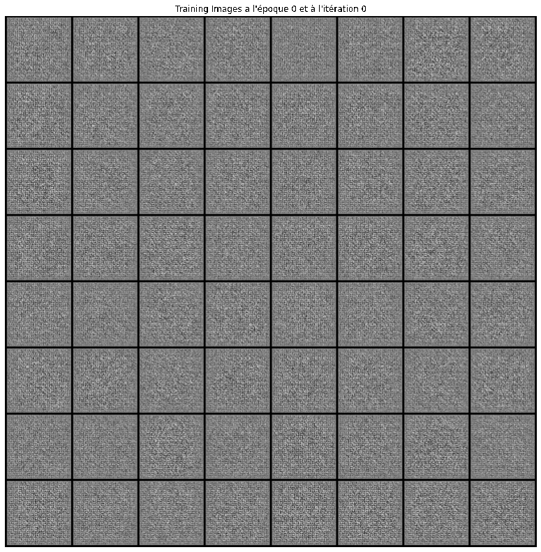
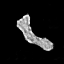

# Stage M1 Generative Adversarial Network

## I Introduction
Ce stage de M1 portait sur les GANs (Generative Adversarial Network). Plus précisément, il s'agissait de se demander si l'augmentation de donnée à l'aide de GAN pour la segmentation d'images biomédicales était pertinente.

Nous travaillons avec des images de cellules prises aux microscopes électronique (FIB-SEM). Ces images comportent plusieurs organelles qui nous interessent comme les mitocondries ou le noyau de la cellule. Nous nous sommes concentrés sur les réticulums endoplasmiques, mais tout ce que nous avons fait est très facilement réplicable sur les autres organelles de la cellule, le travail réalisé a été pensé pour être le plus générique et modulable possible.

    <b>Image d'une coupe de cellule acquise au microscope électronique</b>

Notons que nous avons à notre disposition, en plus des images, les annotations correspondants à ces images (sous forme de masque binaire).

    <b>Annotations des reticulums correspondant à la coupe au microscope</b>

    

L'idée de ce stage était donc dans un premier temps de faire de l'augmentation de donnée en générant de faux patchs d'organelles grâce aux GANs, puis de voir si la segmentation en était améliorée. Nous n'avons pu travailler que sur la première partie, étant donné que la génération de patchs de réticulum n'a pas abouti comme nous l'aurions souhaité.

## II Génération de masques binaire

La première idée que nous avons mise en place a été la génération de masque binaire ayant la forme des reticulums. Ces masques sont très importants pour l'algorithme de segmentation, puisqu'ils représenteront notre "vérité terrain".

Pour ce faire, nous avons d'abbord du traiter nos vrais masques binaire et les séparer en patchs qui serviront à nourrir le GAN. Ce traitement est réalisé dans le script "connexe_crop_bin_mask.py". Ce script fait simplement de l'isolation de composante connexe en patch de taille 250x250. Il est donc réutilisable pour d'autres organelles.

Une fois établi ce set de donnée composé d'environ 4500 patchs de réticulums, nous avons pu commencer la génération de "faux" masques binaire à l'aide d'un GAN. Nous avons utilisé l'architecture DCGAN (Deep Convolutional GAN), l'algorithme est sous le nom de "dcgan_reticulum.py". Les résultats ont été très satisfaisant et sont présentés ci-dessous.

   <!-- Image à gauche -->
  &nbsp;&nbsp;&nbsp;&nbsp;&nbsp;&nbsp;&nbsp;&nbsp;&nbsp;
   <!-- Image à droite -->

    <b>A gauche, les vrais patchs de masque binaire, à droite ceux générés</b>

    

## III Génération de patchs avec la texture

La deuxième idée a été de générer des patchs de réticulums, mais cette fois ci "texturés", dans le sens où on souhaitait qu'ils ressemblent à de vrais réticulums. Après plusieurs essais infructueux, nous avons trouvé la bonne façon de nourir le GAN. En quelques mots, on fait de la dilatation morphologique sur les annotations, qui nous servent ensuite à resortir de l'image des patchs de réticulums, mais avec une vue plus large permettant ainsi de distinguer leur contour. On peut voir ci dessous la différence en utilisant et sans utiliser la dilatation. Le script pour faire ces patchs est celui nommé "connexe_crop_dilation.py".

   <!-- Image à gauche -->
  &nbsp;&nbsp;&nbsp;&nbsp;&nbsp;&nbsp;&nbsp;&nbsp;&nbsp;
   <!-- Image à droite -->

    <b>A gauche sans dilatation des annotation, à droite avec. On voit mieux le reticulum dans son emsemble à droite</b>

    

De même, les résultats sont très satisfaisant, comme l'on peut voir ci-dessous.

   <!-- Image à gauche -->
  &nbsp;&nbsp;&nbsp;&nbsp;&nbsp;&nbsp;&nbsp;&nbsp;&nbsp;
   <!-- Image à droite -->

    <b>A gauche on voit l'évolution du GAN à travers les épochs. A droite, échantillon parmi les patchs générés par le GAN : on distingue bien le contour de l'intérieur du réticulum. La texture est plus ou moins bien reconstituée</b>

    

Mais il fallait réussir à générer des patchs complets, pas seulement avec un reticulum, mais également avec le fond derrière. Nous avons d'abbord bêtements nourri le GAN avec les patchs que vous pouvez voir ci dessous (obtenus avec le script connexe_crop_texture_full_patch.py). Le GAN ne sortait que du bruit, c'était prévisible.

Il fallait donc trouver une solution pour générer un patch complet, reticulum et fond compris. Plusieurs idées sont venus comme la génération séparer du reticulum (ce que l'on savait déjà faire) et d'un fond, pour ensuite les réunir. Mais l'idée que nous avons retenu est celle présentée dans le papier de Pandley et al. (https://www.sciencedirect.com/science/article/abs/pii/S1746809419303635).
Pour résumé, son approche consiste à utiliser deux GANs en parallèle, un qui va générer les masques binaires (la vérité terrain), puis un autre qui a l'aide des masques déjà générés, va générer l'image compléte (réticulum avec le fond dans notre cas).

Nous avons donc implémenté l'architecture proposée et avons éssayé de l'entrainer. 
Le papier manquait de clarté et de précisions à certains endroit, et nous avons préféré utiliser l'architecture DCGAN pour le premier GAN présenté dans le papier. En bref, nous avons un peu adapté à notre façon l'architecture qui n'est donc pas exactement la même que celle présentée dans le papier.

Le fichier contenant ces implémentation se nomme "gan_pandley_tuned.py.
Le premier GAN fonctionne puisque c'est le même que nous utilision plus haut.

Quant au Second GAN, nous avons tenter de l'entrainer de mutiples fois, en apportant tantôt des modifications à l'architecture, aux paramètres d'entrainement, en changeant les loss ou bien les optimiseurs. La majorité des fois, le GAN collapsait rapidement. Nous en sommes arrivé à une configuration où le GAN ne collapse plus, mais les loss semblent stagner et le GAN ne semble pas vraiment s'améliorer.

Nous n'avons donc pas réussi à l'entrainer, mais nous avons plusieurs pistes de reflexion :
    - Entrainer plus ou moins le Discriminateur ou le Générateur (par exemple entrainer seulement une 1 fois sur 4 le Discriminateur), cette idée est assez fréquemment reprise dans les GANs.
    - Une autre idée serait de baisser la résolution avec laquelle travaille le GAN. Il est réputé que les GANs ne se comportent pas très bien avec une haute résolution d'image. Nous travaillons avec des images de taille 128x128. On peut penser qu'en essayant d'abaisser la résolution en 64x64, cela améliore son comportement (attention, cela nécessite d'adapter l'architecture complète du GAN, et pas seulement la taille des images en entrée).
    
On peut également noter d'autres idées pour arriver au but souhaité. Les GAUGAN peuvent être un bon moyen pour générer des images complètes, ce serait à creuser. Sinon l'idée de générer un fond séparément du réticulum, pourrait aussi être à creuser.

Pour toute question, n'hésitez pas à me contacter à : alexandre.stenger@live.fr

